# Proyecto Final - CONMUTACION Y TELETRAFICO

## Menu Principal Conmutacion-Teletrafico
- [Primer Taller](https://github.com/crivive234/Conmutacion-Teletrafico)

Detección en tiempo real de logos de herramientas DevOps usando **YOLOv8** + **FastAPI** + **Groq**, orquestación de servidores de juego con **Kubernetes + Agones**, auditoría de red con **Parrot OS**, topología de red simulada con **GNS3 + Cisco c3660** y monitoreo con **Grafana + Prometheus**.

Proyecto final de la asignatura **Conmutación y Teletráfico** — Fundación Universitaria Compensar.

---

## Estado del proyecto

| Fase | Descripción | Estado |
|------|-------------|--------|
| 1 | Contenedor YOLO + FastAPI + Web UI | ✅ Completa |
| 2 | Chatbot integrado con detecciones | ✅ Completa |
| 3 | Auditoría de red con Parrot OS | ✅ Completa |
| 4 | Kubernetes + Agones + SuperTuxKart | ✅ Completa |
| 5 | Topología de red con GNS3 + c3660 | ✅ Completa |
| 6 | Monitoreo con Grafana + Prometheus | ✅ Completa |

---

## Logos detectables

| Logo | Herramienta |
|------|-------------|
| 🐳 | Docker |
| 🦭 | Podman |
| 🟣 | Terraform |
| 🖥️ | QEMU |
| 🔴 | Ansible |
| 🐇 | Jenkins |
| ☸️ | Kubernetes |

---

## Arquitectura general

```
Browser (localhost:8001)
  └── Web UI (video + chat)
        ├── Video stream ──→ detector:8000/stream   (MJPEG)
        └── Chat ──────────→ chatbot:8001/chat      (POST)
                                  └── consulta ────→ detector:8000/detections
                                  └── respuesta ───→ Groq API (LLaMA 3.1)

GNS3 — Router Cisco c3660
  ├── fa0/0 → VLAN 10 VIDEO  (10.10.10.0/24) → detector, chatbot
  ├── fa1/0 → VLAN 20 DATOS  (10.20.20.0/24) → Minikube / SuperTuxKart
  └── fa2/0 → VLAN 30 MGMT   (10.30.30.0/24) → Grafana, Prometheus

Kubernetes (Minikube) + Agones
  └── Fleet supertuxkart — 3 GameServers (puertos dinámicos UDP)

Monitoreo
  ├── Prometheus → scrape cadvisor, node-exporter, yolo-exporter
  └── Grafana    → dashboards CPU, RAM, red, detecciones YOLO
```

---

## Cómo se construyó este proyecto

### Fase 1 — Detección YOLO

Se entrenó un modelo YOLOv8 con un dataset sintético generado con `scripts/generate_dataset.py`, que superpone logos PNG con fondo transparente sobre fondos variados. El entrenamiento toma ~30-60 min en CPU y produce `models/best.pt`. El modelo corre dentro de un contenedor Docker con FastAPI exponiendo el stream MJPEG en el puerto 8000.

| | |
|---|---|
| 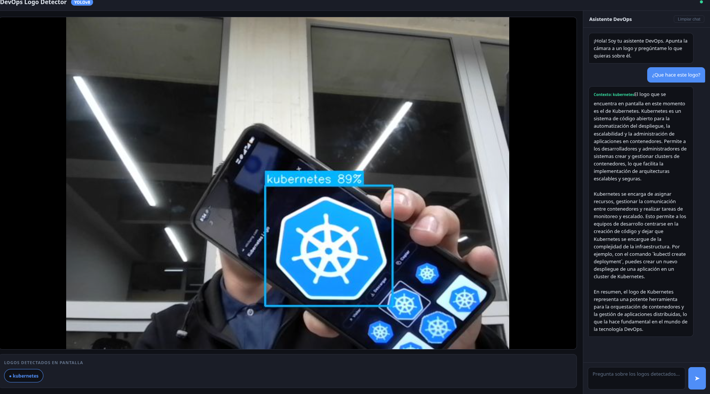 | 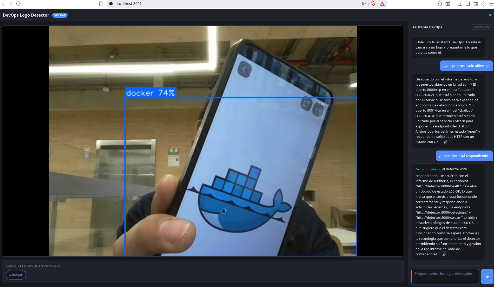 |
brave_screenshot_localhost
### Fase 2 — Chatbot con contexto de logos

Un segundo contenedor corre el chatbot en el puerto 8001. Cada vez que el usuario escribe, el chatbot consulta `/detections` del detector para saber qué logos están en pantalla y los incluye como contexto en el prompt enviado a la API de Groq (LLaMA 3.1). El asistente responde en texto y tiene opción de voz.

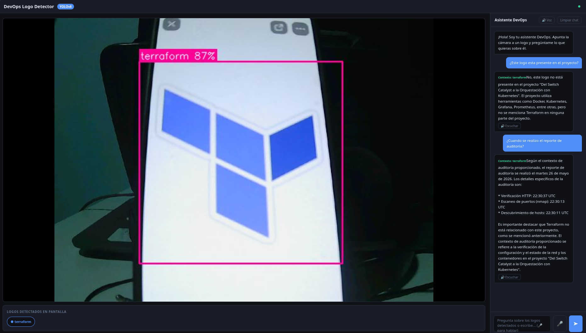

### Fase 3 — Auditoría con Parrot OS

Un contenedor basado en Parrot OS ejecuta scripts de `nmap` para escanear la red interna del proyecto. Genera un reporte HTML automático con los servicios descubiertos, puertos abiertos y verificación HTTP de los endpoints.

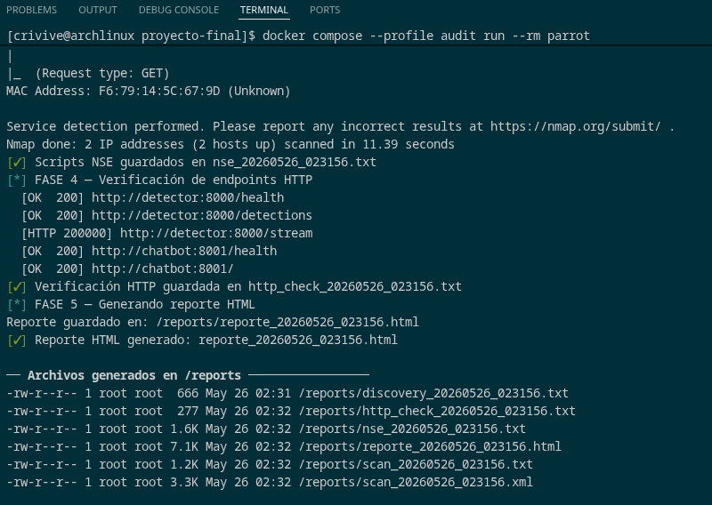
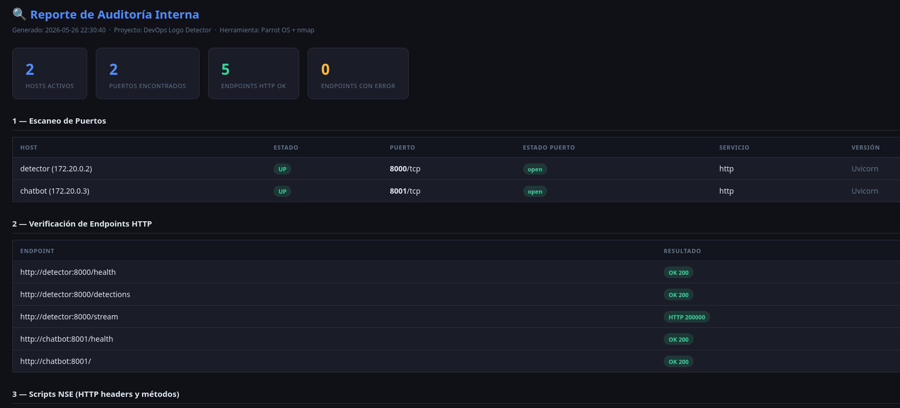

### Fase 4 — Kubernetes + Agones + SuperTuxKart

Se instaló Minikube con driver Docker, se desplegó Agones 1.44.0 vía Helm y se creó una flota de 3 servidores SuperTuxKart con `portPolicy: Dynamic` para que Agones asigne un puerto UDP único a cada GameServer. Los 3 jugadores se conectan al mismo servidor usando la IP `192.168.49.2` y el puerto asignado.

| | |
|---|---|
| 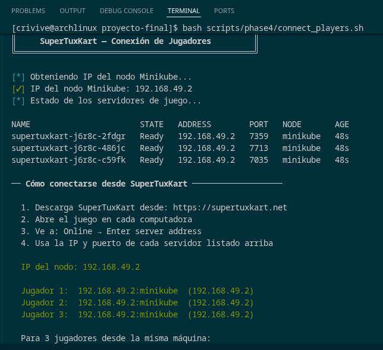 | 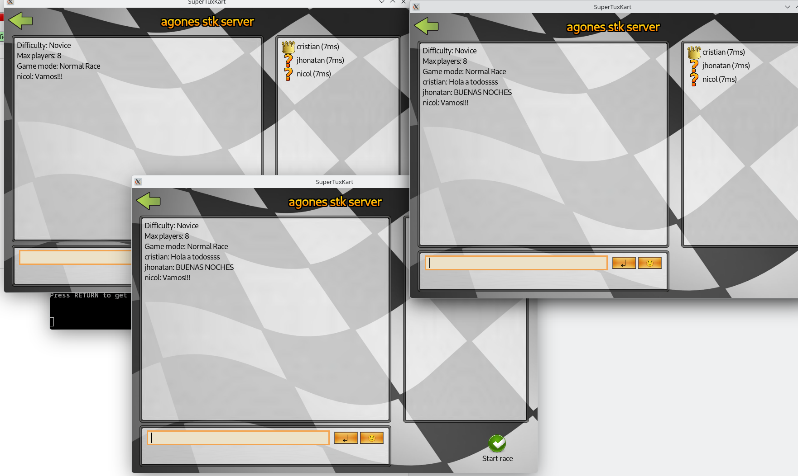 |

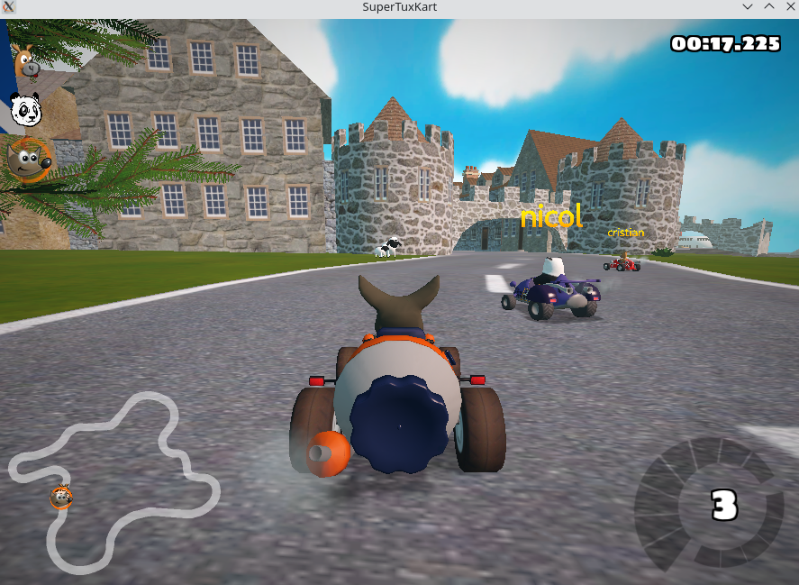

### Fase 5 — Topología de red con GNS3 + Cisco c3660

Se crearon 3 bridges Linux (`br-vlan10`, `br-vlan20`, `br-vlan30`) y se conectaron como nodos Cloud en GNS3. El router Cisco c3660 (Dynamips) enruta entre las 3 VLANs con ACLs extendidas y política QoS CBWFQ que prioriza el stream de YOLO (AF41) sobre el tráfico de juego (AF21) y monitoreo (CS2). El DHCP fue provisto por `dnsmasq`.

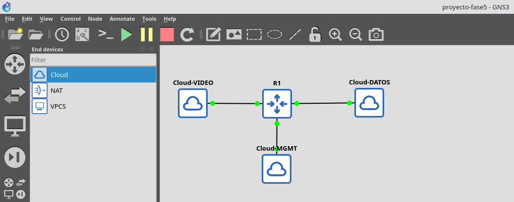

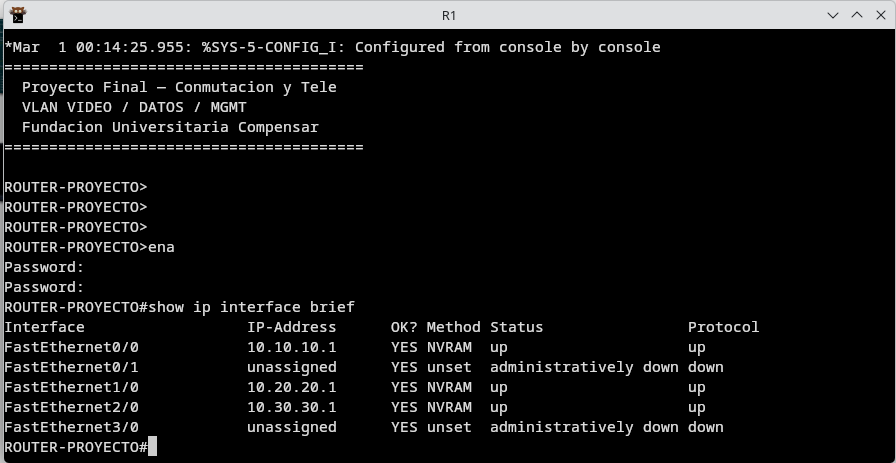

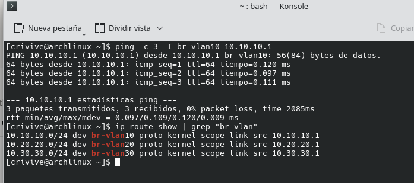

**Capturas Wireshark por VLAN:**

| VLAN VIDEO (gns3tap0-0) | VLAN DATOS (gns3tap1-0) | VLAN MGMT (gns3tap2-0) |
|---|---|---|
| 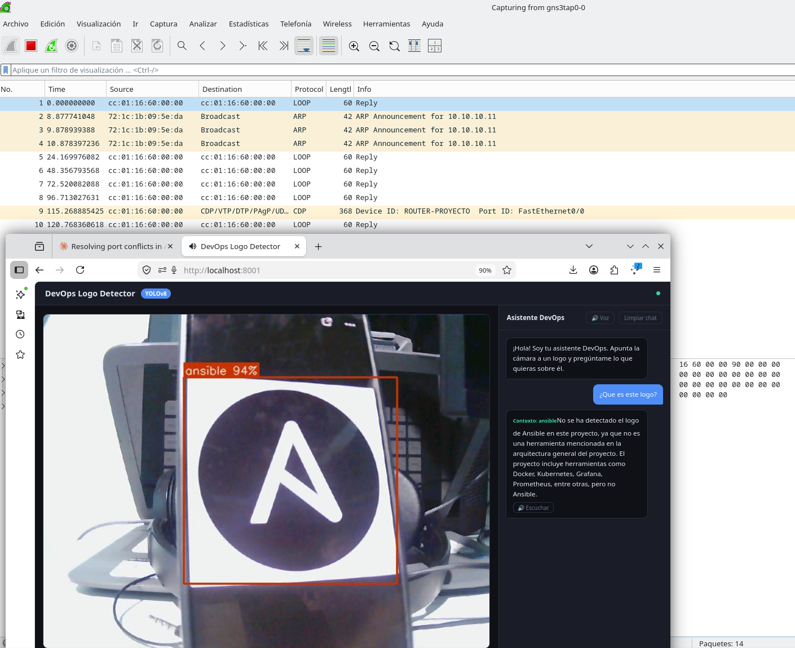 | 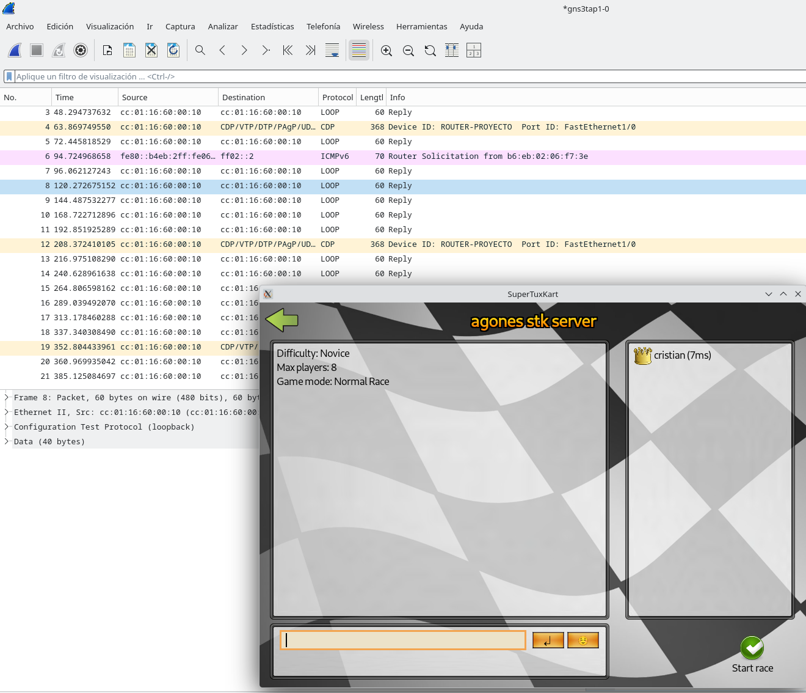 | 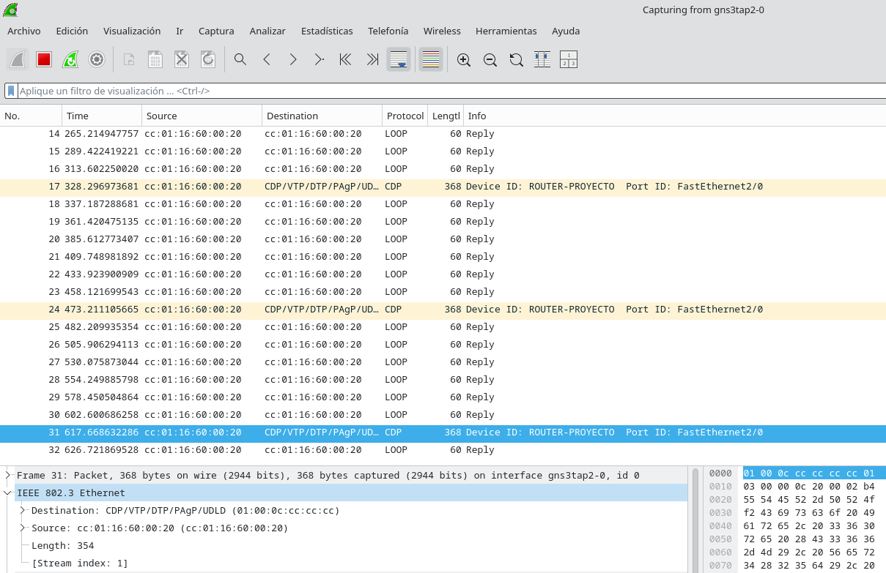 |

Las capturas muestran anuncios CDP del `ROUTER-PROYECTO` en cada interfaz (`FastEthernet0/0`, `FastEthernet1/0`, `FastEthernet2/0`) y tráfico ARP de los contenedores en la VLAN VIDEO.

### Fase 6 — Monitoreo con Grafana + Prometheus

Se levantó un stack de monitoreo en Docker con Prometheus recolectando métricas de cAdvisor (contenedores), Node Exporter (host Arch Linux) y un exportador personalizado `yolo-exporter` que convierte las detecciones de logos en métricas Prometheus. Grafana muestra dashboards en tiempo real con refresh de 10s.

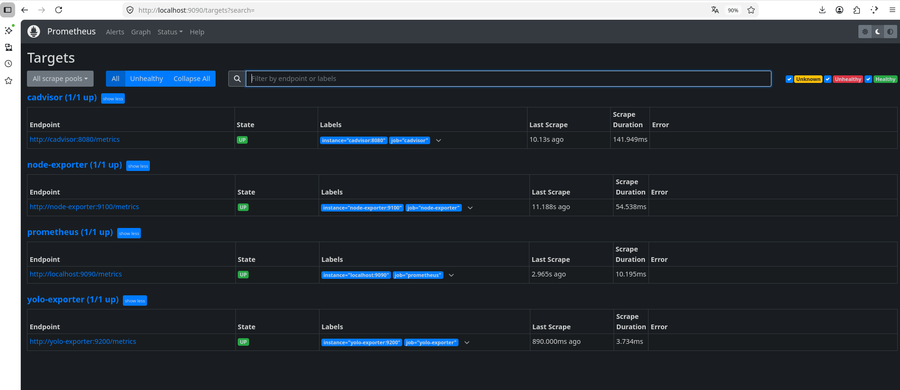

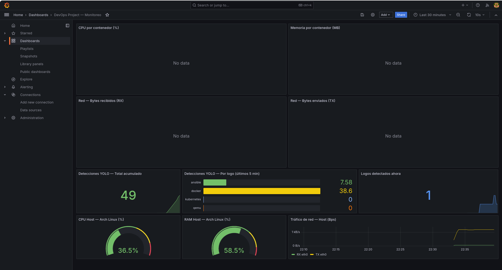

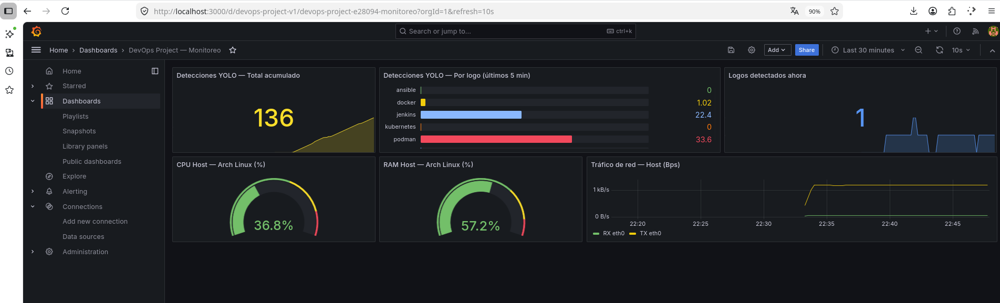

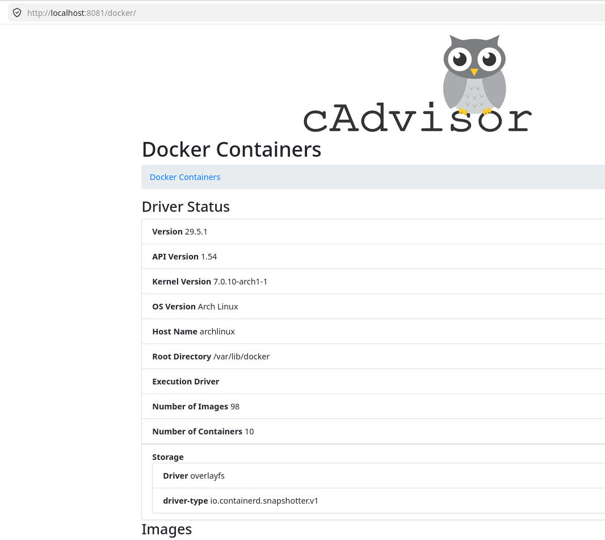

---

## Guía de uso rápido

### Requisitos

- Arch Linux con Docker, Minikube, Helm, GNS3 instalados
- Cámara USB conectada
- Clave API de Groq en `.env`
- Imagen c3660 en `~/GNS3/images/IOS/`
- Modelo entrenado en `models/best.pt`

### 1. Levantar Docker (Fases 1, 2, 3 y 6)

```bash
# Detector + Chatbot + Monitoreo
docker compose -f docker-compose.yml -f docker-compose.monitoring.yml up -d

# Auditoría Parrot OS (opcional)
docker compose --profile audit run --rm parrot
```

Abrir en el browser: **http://localhost:8001** (YOLO + Chatbot)

### 2. Levantar Kubernetes (Fase 4)

```bash
bash scripts/phase4/install_k8s_arch.sh   # primera vez
bash scripts/phase4/setup_agones.sh
bash scripts/phase4/connect_players.sh    # ver IPs y puertos
```

Conectar SuperTuxKart: **Online → Enter server address → `192.168.49.2:<puerto>`**

### 3. Levantar la red GNS3 (Fase 5)

```bash
sudo bash scripts/phase5/setup_network.sh
# Luego abrir GNS3 y seguir: scripts/phase5/gns3_guide.md
```

### 4. Acceder al monitoreo (Fase 6)

| Servicio | URL | Credenciales |
|----------|-----|--------------|
| Grafana | http://localhost:3000 | admin / admin |
| Prometheus | http://localhost:9090 | — |
| cAdvisor | http://localhost:8081 | — |

### 5. Apagar todo

```bash
# Docker
docker compose -f docker-compose.yml -f docker-compose.monitoring.yml down

# Kubernetes
minikube stop

# Red GNS3
sudo bash scripts/phase5/teardown_network.sh
```

---

## Estructura del proyecto

```
proyecto-final/
├── app/                          ← Detector YOLO (Fase 1)
│   ├── main.py
│   └── detector.py
├── chatbot_app/                  ← Chatbot (Fase 2)
│   ├── main.py
│   ├── chatbot.py
│   └── templates/index.html
├── parrot_app/                   ← Auditoría (Fase 3)
│   ├── audit.sh
│   └── report.py
├── monitoring/                   ← Stack de monitoreo (Fase 6)
│   ├── prometheus.yml
│   ├── yolo_exporter/
│   └── grafana/
├── scripts/
│   ├── phase4/                   ← Kubernetes + Agones
│   ├── phase5/                   ← GNS3 + c3660
│   └── phase6/                   ← Setup monitoreo
├── evidence/                     ← Capturas de evidencia
├── logos/                        ← PNGs con fondo transparente
├── models/best.pt                ← Modelo entrenado
├── docker-compose.yml
├── docker-compose.monitoring.yml
└── .env
```

---

## Endpoints de la API

| Endpoint | Puerto | Descripción |
|----------|--------|-------------|
| `/stream` | 8000 | Stream MJPEG con bounding boxes |
| `/detections` | 8000 | JSON con logos detectados |
| `/health` | 8000 | Estado del detector |
| `/` | 8001 | Interfaz web |
| `/chat` | 8001 | Chat con el asistente |

---